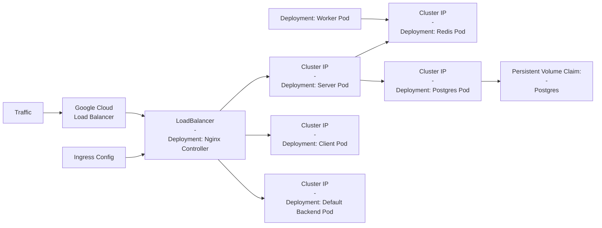

# Fibonacci with IaaC

An intentionally complex App with ReactJS, Express and Redis/Postgres designed to view and store inputs of Fibonacci indices using multiple Docker containers to build and deploy to Google Cloud.

- [fibonacci-IaaC-with-AWS](https://github.com/lmashraf/fibonacci-IaaC/tree/fibonacci-IaaC-with-AWS): Deployment to AWS using Elastic Beanstalk with Docker-Compose.
- [fibonacci-IaaC-local-k8s](https://github.com/lmashraf/fibonacci-IaaC/tree/fibonacci-IaaC-local-k8s|): Deployment locally with minikube.
- [master](https://github.com/lmashraf/fibonacci-IaaC/): Deployment to Google Cloud with Kubernetes.

# High-Level Architecture:

# How To Run Lucally

## Prerequisites

- kubectl : https://kubernetes.io/docs/tasks/tools/install-kubectl-linux/
- minikube : https://minikube.sigs.k8s.io/docs/start/
- docker : https://docs.docker.com/engine/install/ubuntu/
  
## Steps
- `minikube start` 
- run `apply_config.sh` from `/kubernetes/scripts`
- `minikube ip`
- access project from browser at IP address from above (default port: 80 / 443).