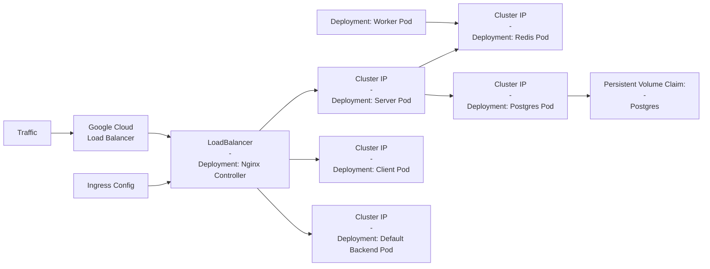

# Fibonacci with IaaC

An intentionally complex App with ReactJS, Express and Redis/Postgres designed to view and store inputs of Fibonacci indices using multiple Docker containers to build and deploy to Google Cloud.

- [fibonacci-IaaC-with-AWS](https://github.com/lmashraf/fibonacci-IaaC/tree/fibonacci-IaaC-with-AWS): Deployment to AWS using Elastic Beanstalk with Docker-Compose.
- [fibonacci-IaaC-local-k8s](https://github.com/lmashraf/fibonacci-IaaC/tree/fibonacci-IaaC-local-k8s|): Deployment locally with minikube.
- [master](https://github.com/lmashraf/fibonacci-IaaC/): Deployment to Google Cloud with Kubernetes.

# High-Level Architecture:

# How To Deploy to Google Cloud:

## Prerequisites:

- Google Cloud account: https://cloud.google.com/free

## Steps:

TBD