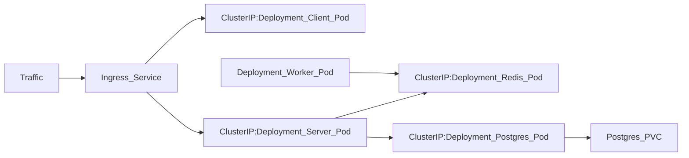

# Fibonacci with IaaC

An intentionally complex App with ReactJS, Express and Redis/Postgres designed to view and store inputs of Fibonacci indices using multiple Docker containers to build and deploy to Amazon Elastic Beanstalk.

see branch: fibonacci-IaaC-with-AWS

# Kubernetes High Level Architecture:

